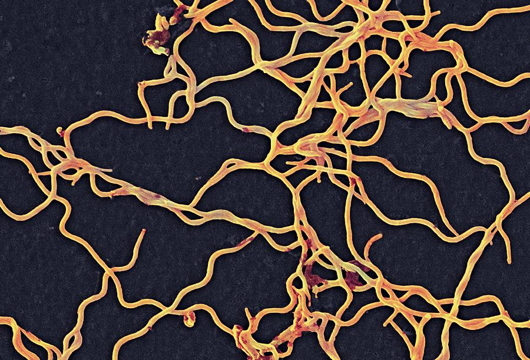

```{r setup, include=FALSE}
knitr::opts_chunk$set(echo = TRUE)
```

##### 1. The required libraries were loaded. 
```{r}
library("dplyr")
library("ggplot2")
library("knitr")
library("stringr")
```


##### 2. the Sequences.csv file was imported
```{r}
Sequences=read.csv("Sequences.csv")
```


##### 3. Each sequence is printed separately. 
```{r}
print(as.character(Sequences$Sequence[1]))
print(as.character(Sequences$Sequence[2]))
print(as.character(Sequences$Sequence[3]))
```

##### 4. The number of each base pair was counted (A,T,C, or G) and the number of each nucleotide as a table for each of the three sequences is presented.  
```{r}
totalContent=str_count(Sequences$Sequence)-str_count(Sequences$Sequence,"\\n")
print(totalContent)
nucA=str_count(Sequences$Sequence,"A")
nucT=str_count(Sequences$Sequence,"T")
nucG=str_count(Sequences$Sequence,"G")
nucC=str_count(Sequences$Sequence,"C")
Sequence = c("HQ433692.1","HQ433694.1","HQ433691.1")
temp=cbind(Sequence,nucA,nucT,nucG,nucC)
colnames(temp)[1]<-"Sequence ID"
kable(temp)
```

##### 5. An image of the Borrelia burgdorferi is attached as well as the Wikipedia link right below it. 



[Borrelia burgdorferi Wikipedia Website](https://en.wikipedia.org/wiki/Borrelia_burgdorferi)


##### 6. GC content was calculated (G or C) and a final table was created showing the GC content for each sequence ID.
```{r}
totalContent=str_count(Sequences$Sequence)-str_count(Sequences$Sequence,"\\n")
cgContent= nucC + nucG
PercentcgContent= (cgContent / totalContent) * 100


temp2=cbind(Sequence,formatC(signif(PercentcgContent,digits=3)))
colnames(temp2)[1]<-"Sequence ID"
colnames(temp2)[2]<-"GC Content (%)"

kable(temp2)

```


#### PART II. graph was created for the "GC_content.csv" file. This graph shows ID and GC content of each Species shown with different color.
```{r}
graphData=read.csv("GC_content.csv")


graphData = mutate(graphData, PercentcgContent = G + C)

colnames(graphData)[5]<-"GC Content (%)"

graph=qplot(x=graphData$ID,y=graphData[["GC Content (%)"]],data=graphData,colour=graphData$Species,xlab="ID",ylab = "%GC Content")
graph$labels$colour <- "Species"

print(graph)
```


#### PART II. ANOTHER graph was created for the "GC_content.csv" file. At the tutorial I was told the above graph was the correct representation. However, I would like to include this graph which shows the percent GC content clearly for each species. 
```{r}
graph2 = qplot(x=graphData$Species,y=graphData[["GC Content (%)"]],colour=graphData$Species,xlab = "Species",ylab = "% GC Content")
graph2$labels$colour <- "Species"

print(graph2)

```

